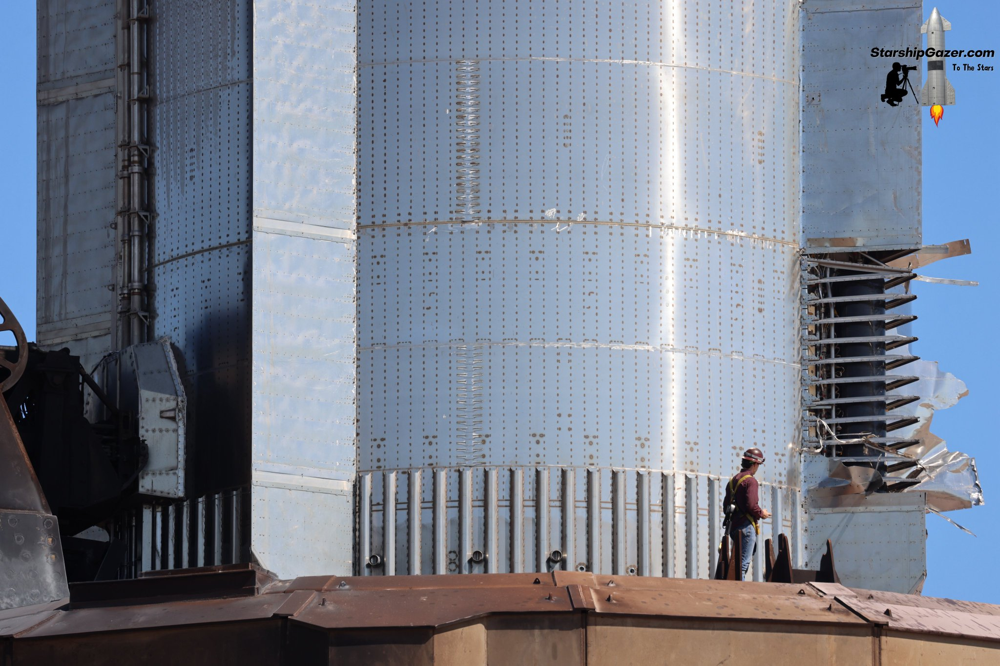

<!--more-->

- [Static Aerosurfaces](#static-aerosurfaces)
  - [Design and Development](#design-and-development)
  - [Roles and Responsibilities](#roles-and-responsibilities)
    - [Designer](#designer)
    - [Analyst](#analyst)
    - [Manufacturing Engineer](#manufacturing-engineer)
    - [Test Engineer](#test-engineer)
  - [Strakes](#strakes)
    - [Composite Design](#composite-design)
    - [Analysis](#analysis)
  - [Aeroshell](#aeroshell)
    - [Sheet Metal Design](#sheet-metal-design)
    - [Machined Components](#machined-components)
    - [Analysis](#analysis-1)
- [Heat Shield Development](#heat-shield-development)
  - [Thermal Analysis](#thermal-analysis)
  - [Testing \& Correlation](#testing--correlation)
- [Fluids Integration](#fluids-integration)
  - [CH4 Manifold Design](#ch4-manifold-design)
- [Side Projects and Additional Contributions](#side-projects-and-additional-contributions)
  - [CAD Automation Tools](#cad-automation-tools)
  - [Thermal Blanket Testing](#thermal-blanket-testing)
  - [S1 Tank Lifting Brackets](#s1-tank-lifting-brackets)
  - [MEWP + S1 Fairing Qualification Test](#mewp--s1-fairing-qualification-test)

In my time working as a Development Engineer on the Neutron program I took the opportunity to get as involved in as many different parts of the vehicle as possible, working on everything from heat shields to cryogenic methane seals.

## Static Aerosurfaces

My main responsibility was the **design and development of the static aerosurfaces** of the vehicle. This involved managing interfaces across a wide range of systems. Given that build priorities focused on primary structures (Thrust Module, S1 Tank, Interstage, S2), I often operated independently with minimal resourcing, requiring strong ownership and initiative.

### Design and Development

This role required full ownership of the aerosurface subsystems, spanning design, simulation, and manufacturing; demanding tight collaboration with multidisciplinary teams to manage complex system-level interfaces.

**Key Achievements:**
- Delivered critical vehicle aerodynamic surfaces under aggressive timeline constraints.
- Developed complete flight hardware from concept to production with minimal engineering support.
- Identified and resolved multi-system integration issues independently.

### Roles and Responsibilities

#### Designer
- Led **concept development** of aerosurfaces from blank-sheet to detailed design.
- Performed **systems engineering** functions including:
  - Requirement capture, derivation, and traceability
  - Risk identification and mitigation throughout the lifecycle
  - Coordination of reviews from **CoDR -> CDR**
  - Authored interface control documents (ICDs) and participated in system-level configuration control boards.
- Sole owner of Aerosurface **CAD in Siemens NX**; used **Teamcenter PLM** for version control, BOM management, and design releases.
- Produced **release packages**, including drawings and part files, to support internal and external vendors.
- Presented design reviews to senior engineering leadership and program management.

#### Analyst

- Independently performed **FEA structural simulations** using **NASTRAN** (linear statics, buckling, non-linear glue modeling).
- Designed and analyzed **Thermal Protection Systems (TPS)** using both in-house and proprietary tools.
- Created custom Python-based analysis tools for:
  - Thermal and structural modeling
  - Data parsing and visualization
  - Reusable simulation workflows for future projects
- Implemented **version-controlled scripts** with `git` for repeatable, auditable analysis workflows.
- Reduced structural design iteration time by automating test-case setup, meshing, and post-processing pipelines.
- Interpolated **vehicle-level CFD results** across multiple flight trajectories to generate time-varying thermal and pressure environments, which were used to derive structural load cases.
- Contributed to the program's **compartment venting solver**, owning 5 of the 8 vehicle compartments and supporting their pressure equalization modeling under ascent, descent, and landing scenarios.

#### Manufacturing Engineer
- Designed custom tooling and fixtures for:
  - Composite layups (plugs, plants, molds)
  - Sheet metal forming (formblocks, jigs)
  - Large Assemblies
- Interfaced directly with manufacturing technicians to troubleshoot and adapt hardware designs.
- Defined process specifications for hand layup and metal forming.
- Reduced composite part cycle time by streamlining tooling design and integrating DFM best practices.
- Conducted shop-floor support during builds to resolve tooling or fit-up issues in real-time.
  
#### Test Engineer

- Supported **heat shield component testing**, including thermal cycle and propane torch-based exposure tests simulating flight-relevant thermal loads.
- Executed **hands-on test operations** using torch rigs, high-temperature insulation materials, and custom-built fixtures for representative boundary conditions.
- Installed and calibrated **thermocouples** on heat shield test articles; supported high-density DAQ systems (**NI 9213**, **NI 9205**) with **FlexLogger** for data acquisition.
- Supported **thermal blanket qualification** efforts in sensor installation and testbed integration.
- Automated **thermal and pressure data analysis** using Python.
- Participated in **real-time test monitoring**, test readiness reviews, and emergency hardware modifications during high-priority test events.

---

### Strakes
Owned the complete development lifecycle of the **vehicle strakes**, from early concepts to final flight-ready hardware. 

  Images below show competititor designs, does not indicate similarity to Neutron designs.

  <figure style="text-align: center; margin: 0;font-style: italic;">
    
    <figcaption>Starship chine damage      <a href="https://x.com/StarshipGazer/status/1845915125829730432" target="_blank" rel="noopener noreferrer" style="text-decoration: none; color: b; font-size: smaller; vertical-align: super;">src</a>
</figcaption>
  </figure>

  <figure style="text-align: center; margin: 0;font-style: italic;">
    
    <figcaption>New Glenn tunnel + wings
    <a href="https://www.nytimes.com/live/2025/01/16/science/blue-origin-new-glenn-launch/how-blue-origin-could-beat-spacex-to-the-moon" target="_blank" rel="noopener noreferrer" style="text-decoration: none; color: b; font-size: smaller; vertical-align: super;">src</a>
    </figcaption>
  </figure>

  <figure style="text-align: center; margin: 0;font-style: italic;">
    
    <figcaption>Terran R access panels
    <a href="https://youtu.be/2jlhxFZkw9E?t=138" target="_blank" rel="noopener noreferrer" style="text-decoration: none; color: b; font-size: smaller; vertical-align: super;">src</a>
    </figcaption>
  </figure>

#### Composite Design
- Utilized **Fibersim** to define ply layups and optimize structural stacking sequences.
- Engineered **sandwich panel** architectures for weight and stiffness optimization.
- Developed and manufactured:
  - Molds + Plugs + Plants + Bucks
- Managed similar design variants through unique use of **NX Part Families**.

#### Analysis
- Ran advanced NASTRAN simulations:
  - `SOL101`, `103`, `106`, and `401` for cohesive and bonded composite analysis.
- Focused on composite-specific failure modes and glue line modeling.
- Reduced part weight by over 30% via composite material optimization without compromising performance.
- Achieved first-pass success in design reviews due to thorough simulation and validation.
---
### Aeroshell

Tasked with recovering an aeroshell concept that had failed its PDR, I reworked the entire concept under significant time and interface constraints.

  Images below show competititor designs, does not indicate similarity to Neutron designs.

  <figure style="text-align: center; margin: 0;font-style: italic;">
    
    <figcaption>Starship aft view      
    <a href="https://x.com/elonmusk"
     target="_blank" rel="noopener noreferrer" style="text-decoration: none; color: b; font-size: smaller; vertical-align: super;">src</a>
</figcaption>

  </figure>
  <figure style="text-align: center; margin: 0;font-style: italic;">
    
    <figcaption>New Glenn base with skirt     
    <a href="https://cdn.arstechnica.net/wp-content/uploads/2024/10/GaqSA8jXkAAwPMX.jpeg"
     target="_blank" rel="noopener noreferrer" style="text-decoration: none; color: b; font-size: smaller; vertical-align: super;">src</a>
</figcaption>

  </figure>
    <figure style="text-align: center; margin: 0;font-style: italic;">
    
    <figcaption>Recovery Electron with skirt      
    <a href="https://x.com/RocketLab/status/1747726319910355424/photo/1"
     target="_blank" rel="noopener noreferrer" style="text-decoration: none; color: b; font-size: smaller; vertical-align: super;">src</a>
</figcaption>

#### Sheet Metal Design
- Forming techniques:
  - Rubber press forming
  - Stretching, shrinking, wheeling, flow forming and flaring
- Riveted assembly design and fit-up jig development
- Defined forming specs and tolerances to meet functional and assembly requirements.

#### Machined Components
- Designed precision parts under tight DFM constraints, with careful consideration for assembly interfaces and stack-ups.
- Applied detailed **GD&T** and defined critical datums to ensure fit and function across builds.
- Specced **materials**, **surface finishes**, and **coatings** for mechanical and environmental performance.
- Coordinated with internal and external **machining vendors** on tolerances, cost, and manufacturability.
- Supported **first article inspections** and resolved NCRs through design updates or concessions.

#### Analysis
- Used **NASTRAN** `SOL101`, `103`, `106` for stress, vibration, and thermal deflection analysis.
- Delivered a fully redesigned aeroshell that passed subsequent reviews and transitioned to production.
- Minimized tooling cost by aligning designs with existing press and supplier capabilities.

## Heat Shield Development

Supported early-stage development of the **reusable heat shield system** before the formation of a dedicated TPS team, contributing across design, analysis, and test efforts.

  Images below show competititor designs, does not indicate similarity to Neutron designs.

  <figure style="text-align: center; margin: 0;font-style: italic;">
    
    <figcaption>Falcon 9 Base Heatshield
    <a href="https://www.teslarati.com/spacex-falcon-9-rocket-shown-off-in-unprecedented-detail-ahead-of-next-us-air-force-launch/gps-iii-sv03-falcon-9-b1060-processing-2019-spacex-octaweb-3/"
     target="_blank" rel="noopener noreferrer" style="text-decoration: none; color: b; font-size: smaller; vertical-align: super;">src</a>
</figcaption>

  </figure>
  <figure style="text-align: center; margin: 0;font-style: italic;">
    
    <figcaption>New Glenn base tps install     
    <a href="https://cdn.arstechnica.net/wp-content/uploads/2024/10/GaqSA8jXkAAwPMX.jpeg"
     target="_blank" rel="noopener noreferrer" style="text-decoration: none; color: b; font-size: smaller; vertical-align: super;">src</a>
</figcaption>

  </figure>
    <figure style="text-align: center; margin: 0;font-style: italic;">
    
    <figcaption>Mercury Shingles      
    <a href="https://airandspace.si.edu/collection-objects/mercury-friendship-7/nasm_A19670176000"
     target="_blank" rel="noopener noreferrer" style="text-decoration: none; color: b; font-size: smaller; vertical-align: super;">src</a>
</figcaption>

  </figure>
    <figure style="text-align: center; margin: 0;font-style: italic;">
    
    <figcaption>Terran R TPS      
    <a href="https://youtu.be/wlA3poh-eF4?t=31"
     target="_blank" rel="noopener noreferrer" style="text-decoration: none; color: b; font-size: smaller; vertical-align: super;">src</a>
</figcaption>

### Thermal Analysis

- Contributed to an in-house Python-based thermal solver used by the TPS group.
  - Improved runtime performance (~2× speedup).
  - Enhanced configuration management for more flexible case setups.
- Used the solver to optimize material selection and thickness distribution across heat shield regions.

### Testing & Correlation

- Designed and executed **thermal testing of heat shield materials and assemblies**, including:
  - **Propane torch tests**
  - **Environmental chamber cycles**
  - Realistic thermal load simulations derived from CFD-based environments
- Correlated test results with **thermal and structural models** to validate the flight performance of the **Thermal Protection System (TPS)**.
- Developed **automated post-processing scripts** in Python to convert raw sensor data into meaningful performance insights.
- Informed **design trade studies and hardware selection** by mapping test/model results to vehicle-level thermal environments.

## Fluids Integration
Led design of the **Stage 1 tank fluids raceway**, responsible for fluid routing within a space-constrained launch vehicle environment.

  Some images below show competititor designs, does not indicate similarity to Neutron designs.

  <figure style="text-align: center; margin: 0;font-style: italic;">
    
    <figcaption>Falcon 9 Base Heatshield
    <a href="https://www.teslarati.com/spacex-falcon-9-rocket-shown-off-in-unprecedented-detail-ahead-of-next-us-air-force-launch/gps-iii-sv03-falcon-9-b1060-processing-2019-spacex-octaweb-3/"
     target="_blank" rel="noopener noreferrer" style="text-decoration: none; color: b; font-size: smaller; vertical-align: super;">src</a>
</figcaption>

  </figure>
    <figure style="text-align: center; margin: 0;font-style: italic;">
    
    <figcaption>Through tank port      
    <a href="https://youtu.be/wlA3poh-eF4?t=31"
     target="_blank" rel="noopener noreferrer" style="text-decoration: none; color: b; font-size: smaller; vertical-align: super;">src</a>
</figcaption>

  </figure>
    <figure style="text-align: center; margin: 0;font-style: italic;">
    
    <figcaption>Neutron S2 CH4 throughport and manifold on test stand     
    <a href="https://www.flickr.com/photos/rocketlab/albums/72177720311279239/"
     target="_blank" rel="noopener noreferrer" style="text-decoration: none; color: b; font-size: smaller; vertical-align: super;">src</a>
</figcaption>

 Key contributions:

- **Component design & packaging:** Created compact, efficient layouts optimized for performance and manufacturability.
- **Routing layout:** Engineered fluid line paths to optimise for assembly and avoid system interference.
- **Bracket & support structures:** Designed mounts to meet vibration, structural, and accessibility constraints for ground and flight ops.
- **P&ID improvements:** Contributed to the vehicle P&ID Git repository, improving line routing and alignment to improve physical integration.

Enabled safe, reliable fluid delivery critical to Stage 1 propulsion and tank pressurization systems.

### CH4 Manifold Design

Owned design of the **machined CH4 manifold weldment** interfacing with Stage 1 systems:

- **System integration:** Supported the **vent relief valve manifold** and **autogenous pressurization system** through a shared block interface.
- **Dual redundant seals:** Designed around AS5857-compliant seals at the carbon composite flange for high-integrity pressure containment.
- **Welded interfaces:** Collaborated with materials/welding teams to ensure structural soundness and manufacturability.
- **Tolerancing & geometry:** Managed complex port layouts and stack-ups to support fluid sealing and adjacent hardware even under a wide range of thermal loads.

Delivered the manifold from concept through machining and supporting fluid system functionality.

## Side Projects and Additional Contributions

### CAD Automation Tools
- Developed a **custom DXF export tool** in NX using NXOpen and Block UI Styler.
- Automated the generation of manufacturing drawings for large sheet metal assemblies.
- Core contributor to internal NX automation scripts.
- Saved ~2 hours per week in drawing generation for large sheet metal assemblies. 
- Tool adopted team-wide and contributed to internal process improvements.

### Thermal Blanket Testing
- Performed qualification testing of thermal blankets and their controller for curing using NI DAQ tools.
- Verified system response and process accuracy under controlled heating/pressure.
- Utilized:
  - **NI 9213** for temperature measurement
  - **NI 9205** for pressure monitoring

### S1 Tank Lifting Brackets
- Volunteered for first carbon composite bracket design task.
- Designed lifting brackets used during tank operations and integration.
- Integrated closely with adjacent aerosurface hardware.

### MEWP + S1 Fairing Qualification Test
- Supported urgent hardware modifications to enable next-day qualification test execution.
- Assisted in rapid prototyping, fitting, and installation of test brackets.
- EWP certified 

  

  Fairing on test stand with internal spyder crane superimposed for clarity.
      <a href="https://blogger.googleusercontent.com/img/b/R29vZ2xl/AVvXsEiv2FXxZGS3f1vQvT85nx-i8_2If8-yMgL3wlqdP342k5UUgbFPwXnUpme0vAA9t8CRz9p8fzvpbKOi7Lc3AJYpr18s1BhZEPrHe6eVWm_LznNtuenXSIv4mOmilruMES0rlt_RPz8eZd_rHCZURp99ri7r9tkeg7Q2B7UNo2krFp4b0SVHuOeo50Z5V53G/s3544/IMG_5163.JPG"
     target="_blank" rel="noopener noreferrer" style="text-decoration: none; color: b; font-size: smaller; vertical-align: super;">src</a>

